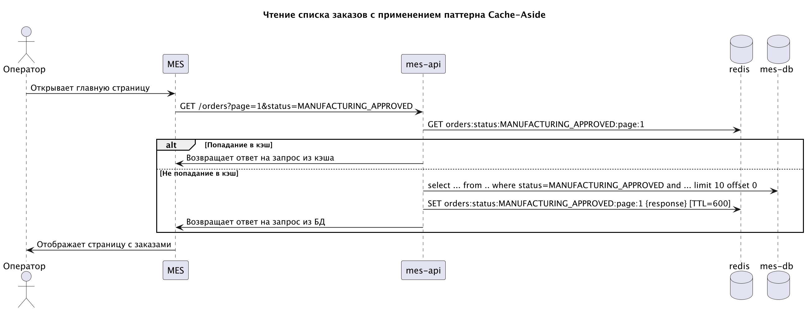
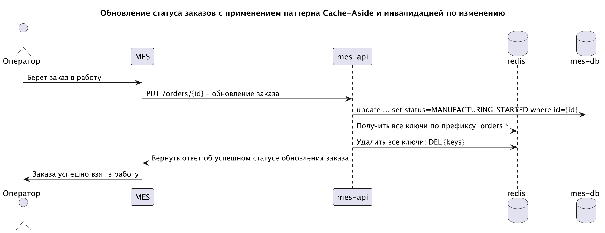

# Мотивация

На данный момент среди всех обозначенных проблем в текущем решении основная проблема связанная с производительностью -
это открытие главной страницы MES, предоставляющей список открытых заказов для операторов, которые можно
взят в работу. Большое количество жалоб поступает от операторов на скорость открытия главной страницы MES.

Внедрение кэширование в первую очередь будет предназначено для решения проблемы выше, т.е. - повышение скорости
открытия главной страницы MES. При увеличении нагрузок, наличие внедренных механизмов кэширования
упростит дальнейшие доработки.

Кэширование поможет решить данную проблем без необходимости масштабирования БД.

## Элементы системы включенные в кэширование

* сервис mes - через кэширование статических ресурсов на стороне клиента;
* сервис mes-api - через кэширование на стороне сервера.

# Предлагаемое решение

В качестве решения необходимо внедрить и клиентское и серверное кэширование.

Для кэширования статистической информации - картинки, страницы, стили и т.д., требуется
внедрить клиентское кэширование, статическая информация должна кэшироваться на стороне браузера пользователя.

Для кэширования актуальных заказов, которые можно взять в работу предлагается использовать
кэширование на стороне сервера.

В качестве решения предлагается руководствоваться следующими требования:

* при реализации кэширования требуется использовать паттерн Cache-Aside;
* в качестве СУБД для кэширования данных предлагается использовать Redis;
* стратегия инвалидации кэша - комплексная:
    * инвалидация на основе изменений: при добавлении заказа или обновлении заказа - кэш очищается;
    * временная инвалидация: записи в кэше имеют установленный TTL;

## Чтение списка заказов с применением паттерна Cache-Aside
[Диаграмма последовательности](mes_cache_aside.puml)

## Обновление статуса заказов с применением паттерна Cache-Aside и инвалидацией по изменению
[Диаграмма последовательности](mes_cache_aside_update_order.puml)

## Обоснование выбора паттерна кэширование

Сравнение паттернов кэширования представлено в таблице ниже.

| Паттерн       | Плюсы/минусы                                                                                                                                                       | Почему подходит                                                                                                                                 |
|---------------|--------------------------------------------------------------------------------------------------------------------------------------------------------------------|-------------------------------------------------------------------------------------------------------------------------------------------------|
| Cache-Aside   | Простота реализации, направлен на частые чтения, редкие записи, актуальнось  записей может гарантироваться за счет реализации правильных стратегий инвалидации | Подходит: простота реализации, направлен на бОльшее количество операций чтения против операций записи, контроль находится на стороне приложения |
| Write-through | Позволяет держать в кэше максимально актуальные записи, усложняет операции записи,  реализация сложнее, т.к. придется поддержать все места операций на запись  | Не подходит из-за сложности реализации и повышения задержек при записи                                                                          |
| Refresh-Ahead | Высокая простота реализации, записи в кэше быстро становятся не актуальными,  если запись не является редкой операцией                                         | Не подходит из-за требований к актуальности данных по заказам                                                                                   |

## Стратегия инвалидации кэша

Сравнение стратегий инвалидации представлено в таблице ниже.

| Стратегия            | Применение      | Почему                                                                                                                                                                                                                            |
|----------------------|-----------------|-----------------------------------------------------------------------------------------------------------------------------------------------------------------------------------------------------------------------------------|
| Временная (TTL)      | Да, в комплексе | Самостоятельно применяться не может, так как заказы в кэше могут перестать не актуальными. Предлагается использовать совместно с инвалидацией по ключу или на основе изменений                                                    |
| По ключу             | Вомзожно        | Требует более серьезной проработки (требует проработки ключей и точной структуры хранения), чем инвалидация на основе изменений, однако позволит инвладировать более точечно в связи с чем, производительность в общем будет выше |
| На основе изменений  | Да, в комплексе | Простота реализации - там где обновляются заказы и статусы, требуется инвалидировать кэш, актуальность данных будет достигнута                                                                                                    |

Комплексны подход к выбору стратегии инвалидации кэша: "На основе изменений" и "Временная" позволит держать в кэше только актуальные записи и очищаться редко используемые спустя время.